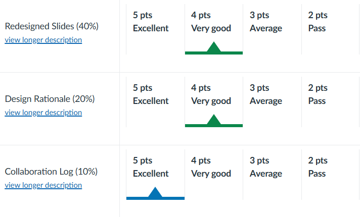

# road-safety-report-redesign
This project involved evaluating and redesigning three data visualization slides from the **Road Safety Authority of Ireland’s 2023 Fatalities Report**, focusing on clarity, perception, and explanatory effectiveness.

The task included collaboration with team and:
- Critically assessing selected slides based on visual perception and explanatory principles
- Redesigning the slides using best practices in chart selection, color use, and layout
- Providing a short rationale explaining key design decisions

All work was completed as part of an academic assignment focused on effective data communication.

## 📝 Before vs After Slides

We selected and redesigned 3 original slides from RSA's 2023 fatalities report.

- 📄 [`Original Slides.pdf`]
- 🎨 [`Redesigned Slides.pdf`]

## 🧠 Professor Feedback

Below is the instructor’s evaluation of our redesign and critique work:

